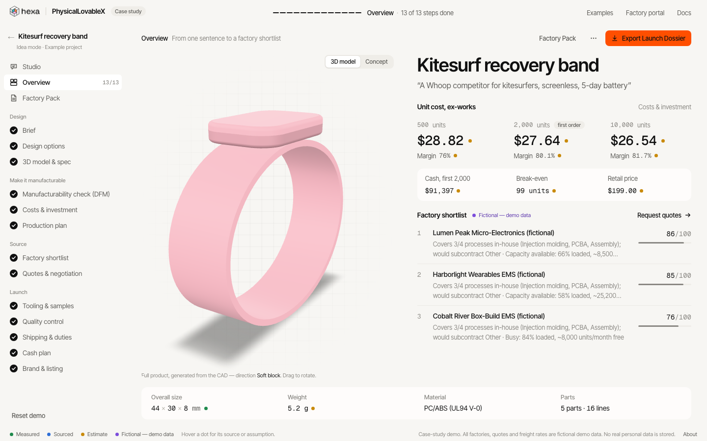
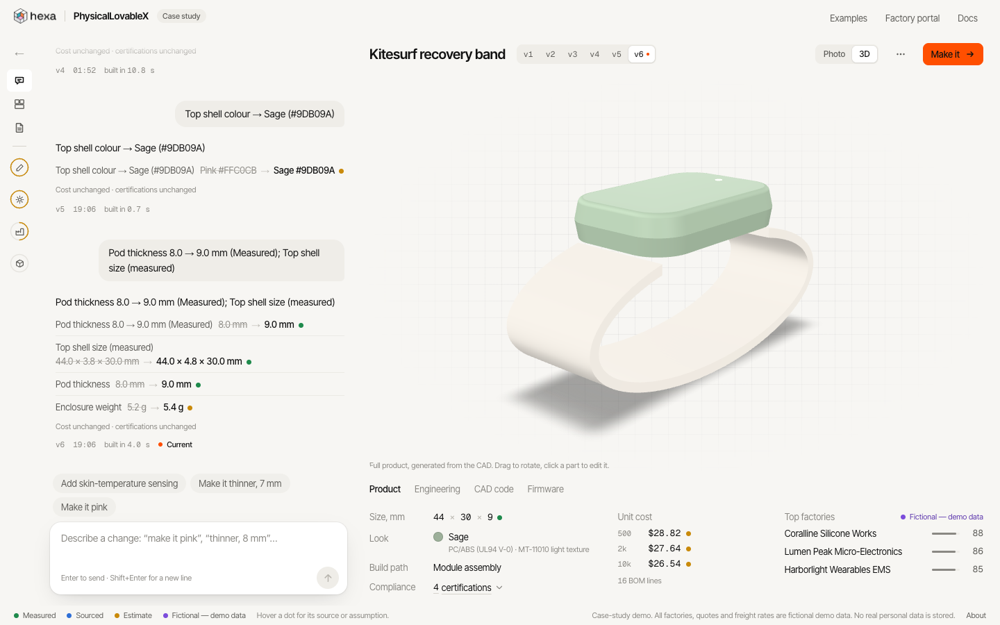
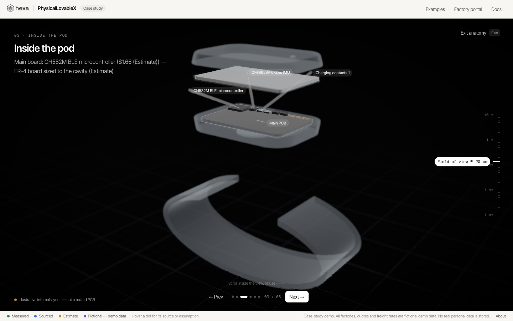
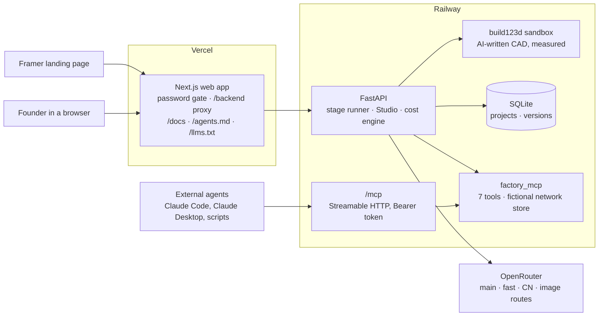

# PhysicalLovableX

Describe a physical product in one sentence; get a 3D model, its unit cost, a factory shortlist, and a package a factory can quote from.

## In 30 seconds

**What it does.** A Studio where you describe a product ("a Whoop competitor, screenless, 5-day battery"), see it in 3D with its cost at 500 / 2,000 / 10,000 units and its top factories, refine it by prompting, then press **Make it** to autofill the rest of the path to production: factories, negotiation, tooling, QC, logistics and duties, cash plan, brand. The output is a **Launch Dossier** (EN + CN).

**For whom.** Hardware founders, first consumer-electronics founders who have a prototype and pledged money and are stuck on production (`gtm-harness/context/icp.md`).

**The thesis.** Hardware ships late because nobody translates the idea into what a factory can build: making it manufacturable, choosing components, passing certification, speaking the factory's language. It is not mainly a design problem or a factory-access problem. We do the translation. The primitive is the **Factory Pack**: a spec package a factory can quote and build without back-and-forth. Every later layer (negotiation, QC, logistics, financing) consumes it (`docs/PRODUIT.md`, `docs/PRD.md` §1-3).

**How.** In software the AI writes code; in hardware, **CAD is code**. The AI writes build123d programs, they run in a sandbox, the result is measured, and on an error the AI repairs its own code.

## Links

| | |
|---|---|
| Live app | https://physicallovablex.vercel.app (password in the email) |
| Public docs | https://physicallovablex.vercel.app/docs |
| Agent guide | https://physicallovablex.vercel.app/agents.md (also `/llms.txt`) |
| Demo video | see email |

## What you can do

1. **Describe.** One sentence, in idea mode or prototype mode (paste a BOM).
2. **See.** The product in 3D, unit cost at 500 / 2k / 10k, and a top-3 factory shortlist on one screen. First version in 18-24 s over several live runs.
3. **Refine by prompting.** "Add SpO2 and skin-temperature sensing", "make it pink", "thinner, 8 mm pod". Each prompt creates a restorable version with a diff (CAD, BOM with real LCSC parts, costs, measured DFM, certifications, shortlist). Geometry changes are made by the AI editing its own build123d program, which is re-run, re-measured and self-repaired on error; the code is visible in the "CAD code" tab. Colour and feature refines take 4-7 s, geometry refines 11-24 s.
4. **Touch a part.** Click a part in the 3D view to change its colour, material or a dimension. This is a deterministic edit with no AI call (1.6-3.8 s in QA) and still produces a new version with a diff.
5. **Look inside.** Anatomy mode walks through the product layer by layer, generated from the real BOM. It is labelled "Illustrative internal layout — not a routed PCB".
6. **Make it.** 13 steps autofill to the Launch Dossier (EN + CN) in 54-88 s live, or instantly on the 7 showcases recorded through Make it (11 showcases in all).

**Pro CAD (shipped, on by default).** Standard fasteners, inserts and bosses with ISO 273 clearance holes (`app/api/cad/stdparts/`); assemblies with joints and measured interference and clearance checks (`app/api/cad/assembly/`: 0 interferences on all showcases, and it caught and fixed a real propeller collision on the drone); dimensioned technical drawings in the Studio, the Factory Pack and the Dossier (`app/api/cad/drawings/`). Flags `CAD_DETAIL_LEVEL=pro`, `CAD_ASSEMBLY=1`, `CAD_DRAWINGS=1` (`app/contracts/api.md`).


| Overview: cost at three volumes, shortlist, labels | Refine by prompting and by touching a part |
|---|---|
|  |  |



Timings: `docs/PRODUIT.md`, `app/docs/DEMO_SCRIPT.md` (measured live over several runs; they vary), `app/docs/QA_REPORT.md`.

## The brief → where it lives

| Case layer | What it means here | Where it lives |
|---|---|---|
| **Lovable layer** | Plain language in → design, CAD, spec, investment, production plan; refine by prompting | `app/api/studio/` (versions, refine, part edits), `app/api/cad/codegen/` (AI-written CAD), `app/api/stages/` (13-stage runner), `app/web/src/app/projects/[id]/studio/page.tsx` |
| **Alibaba layer + production MCP** | The spec is matched to a factory network that exposes capacity through an MCP; any agent can search capacity and request quotes | `app/factory_mcp/server.py` (7 tools), `app/api/mcp_http/` (served at `/mcp`), `app/docs/MCP_DEMO.md`, `app/web/src/app/factories/` (portal) |
| **Infra** | DFM, factory selection, agent negotiation, tooling, QC, logistics and duties, financing | `app/api/dfm/`, `app/api/agents/` (incl. `negotiation/`), `app/api/costs/` (cost, landed cost, HTS, freight), `app/api/engineering/` |
| **Value** | The Factory Pack and the Launch Dossier (PDF, EN + CN) | `app/api/export/` (`factory_pack.py`, `pdf.py`), `app/contracts/artifacts.py` (`FactoryPack`) |
| **Why now** | Generative AI can write and repair CAD code; the gap is translation, not sourcing (sourcing is commoditised) | `docs/PRD.md` §2-3, `app/docs/CAD_BENCH.md`, `gtm-harness/CLAUDE.md` (thesis v2) |

## What is real and what is simulated

Every number on screen, in the API and in the PDF carries one of four labels:

| Label | Meaning |
|---|---|
| **Measured** | Computed by code on the CAD (dimensions, volume, draft, wall thickness, physics checks) |
| **Sourced** | Real price or official rate, with source and date |
| **Estimate** | An assumption, shown |
| **Fictional — demo data** | Invented for the demo; factory names end with "(fictional)" |

**Data sources (Sourced):** LCSC / JLCPCB parts snapshot for component prices and stock (dated 2026-09-26); USITC HTS schedule and CBP CROSS rulings for the tariff line and duties; Drewry World Container Index for the sea-freight lane; eCFR and EUR-Lex for certification citations; EU PVGIS for solar yield; V-Trust for the QC man-day benchmark. Code: `app/api/costs/` (`lcsc.py`, `hts.py`, `precedent.py`, `freight.py`, `landed.py`), `app/api/agents/certification.py`, `app/api/engineering/solar.py`.

**Limits** (`app/docs/public/limits.md`):
- CAD is concept-level: good enough to see, measure, cost and brief a factory; not tooling-ready. About 80% of the translation is automated; humans and real factories cover the rest.
- The Anatomy internal layout is illustrative, not a routed PCB. Electronics stop at a power tree, netlist-level connections and a power budget.
- The generated firmware skeleton is not compiled or tested.
- All 15 partners (11 factories, 1 integrator, 3 installers), their capacity, quotes, negotiation replies, carrier freight quotes and transit days are fictional. The negotiation is a real agent loop over the MCP tools, but every reply is simulated; in Make it the quote is auto-approved and flagged.
- The HTS line is a precedent from CBP rulings, not a binding classification.
- The CN translation is machine-made and labelled "to be reviewed by a native speaker".

Stage-by-stage table of what is real: `app/README.md` ("Real vs simulated"). Audit of the labels: `app/docs/HONESTY_AUDIT.md`.

## Measured numbers

| What | Result | Source |
|---|---|---|
| Studio, first version | 18-24 s over several live runs | `docs/PRODUIT.md`, `app/docs/DEMO_SCRIPT.md` |
| Refines | colour and feature 4-7 s; geometry (AI edits its CAD) 11-24 s | same |
| Make it, 13 steps to the Launch Dossier | 54-88 s live (≈ $0.34 in one run) | same |
| Part edits (no AI) | colour 1.6 s, material 1.6 s, dimension 3.8 s (one QA run) | `app/docs/QA_REPORT.md` (3D wave regression, §3) |
| Core path, one live QA run | idea → v1 23.7 s; "Add SpO2…" 5.2 s; "Make it pink" 4.2 s; Dossier export 0.35 s, 38 pages | `app/docs/QA_REPORT.md` (§7) |
| Text-to-CAD benchmark | 20/20 prompts valid on the first try, 95 % within ±25 % of target size, 100 % OCCT-valid; ≈ 27 s per prompt | `app/docs/CAD_BENCH.md` |
| Retrieval-augmented CAD prompts (84 example programs) | no measurable gain on this benchmark; kept off by default | `app/docs/CAD_BENCH.md` |
| Backend tests | 719 passed, 31 skipped (final whole-suite run, C5 regression, 28 Sep; verdict "ready for pass-7") | `app/docs/QA_REPORT.md` ("C5 — pro CAD integration (28 Sep)") |
| Assembly checks | 0 interferences on all showcases; caught and fixed a real propeller collision on the drone | `app/api/cad/assembly/` |
| Web checks | `tsc --noEmit`, `lint`, production build: all pass (same run) | `app/docs/QA_REPORT.md` |
| Anatomy | 5 products, 6-7 steps each, open in ≤ 0.17 s | `app/docs/QA_REPORT.md` (§5) |

The QA report also lists the open bugs found at each wave, with severity.

## Architecture



**Stack.** Python 3.12 with uv, FastAPI, build123d 0.13 (OpenCascade), SQLite, the official MCP Python SDK. Next.js 16, React 19, three.js with react-three-fiber (model-viewer fallback via `?viewer=basic`). Models through OpenRouter on four routes (main, fast, CN, image), configured by environment. Every LLM call goes through `app/api/llm.py` (JSON-schema validation, one retry); any stage failure serves a cached example with a visible banner. Deploy: Railway for the API (Dockerfile, volume at `/data`), Vercel for the web.

## Repository map

```
app/                     the product (see app/README.md)
  api/                   FastAPI backend
    stages/              13-stage runner, plug-in registry, fixture fallback
    studio/              versions, refine jobs, part edits, restore
    cad/                 build123d CAD: families, codegen/ (AI-written CAD), anatomy/, photos/, stdparts/, assembly/, drawings/
    dfm/                 measured DFM on the STEP
    costs/               cost engine, LCSC, HTS, duties, freight, landed cost
    agents/              brief, DFM review, certification, planning, brand, negotiation/
    engineering/         physics checks, electronics, firmware skeleton, build strategy, solar
    export/              Factory Pack assembly and Launch Dossier PDF
    mcp_http/            the production MCP over HTTP at /mcp
    fixtures/            cached examples and showcases (the fallback path)
  web/                   Next.js app (Studio, 13 stages, Overview, portal, public docs)
  factory_mcp/           production MCP server (7 tools) and the fictional network
  contracts/             Pydantic models, JSON schemas, API contract (read first)
  tests/                 pytest suites, CAD benchmark harness, 10-prompt runner
  docs/                  QA report, CAD benchmark, demo script, deploy, honesty audit, public docs, screenshots
  scripts/demo_start.sh  one-command local start
gtm-harness/             go-to-market agent harness (context, skills, workflows, playbooks)
gtm/                     landing copy, sequences, content plan, video scripts
docs/                    PRD.md (full spec), PRODUIT.md (one-page product definition)
```

**Start here** — the 10 files that explain the system fastest:

1. `app/contracts/api.md` — every route, section by section, including the Studio refine job
2. `app/api/stages/runner.py` — how a stage runs and falls back to a cached example
3. `app/api/studio/engine.py` — start, refine, restore; one commit per version or nothing
4. `app/api/cad/codegen/engine.py` — the AI writes build123d, the sandbox runs it, it is measured and repaired
5. `app/api/cad/anatomy/` — the illustrative internal layout built from the BOM (no LLM)
6. `app/api/costs/engine.py` — deterministic cost engine; the LLM only proposes BOM lines
7. `app/api/engineering/service.py` — physics checks, electronics, firmware skeleton
8. `app/factory_mcp/server.py` — the 7 production MCP tools
9. `app/web/src/app/projects/[id]/studio/page.tsx` — the Studio screen
10. `gtm-harness/CLAUDE.md` — ICP, signals, positioning, thesis in one page

## Go-to-market

- `gtm-harness/` is a Claude Code harness for founder-led outreach. `CLAUDE.md` is the one-page brief; `context/` holds the ICP (late crowdfunded consumer-electronics founders first), six scored buying signals with decay, positioning, competitor battlecards, metrics and personas.
- `gtm-harness/skills/` has nine repeatable procedures (ICP scoring, account research, signal-to-sequence, teardown, value pack, reply handling, call debrief, weekly update, AEO check); `workflows/` and `playbooks/` cover routing, campaigns, enrichment, and what to do when a founder replies.
- Rules built in: every claim carries a source or is marked Hypothesis; a human approves and sends every message; no contact data is stored in the repo.
- `gtm/` holds the landing page copy and Framer components, the written (not executed) sequences, a four-week content plan, the GTM stack by phase, and the demo and launch video scripts.

## How it was built

- **Orchestration.** One Monitor session planned the work and dispatched about 40 parallel Claude Code worker sessions (W0-W29, C1-C5). Each worker owned its folders (`app/README.md`, "Layout and owners").
- **Contracts first.** Pydantic models, JSON schemas, the API contract and generated TypeScript types were frozen before the first wave (`app/contracts/`). Changes are additive and recorded per worker in `api.md`.
- **Fixtures and fallbacks.** Every stage has a cached example: on an AI failure it serves that example with a visible "Cached example" banner instead of an error.
- **QA waves.** Dedicated QA sessions ran regression passes between waves, up to release checkpoint pass-6 (`app/docs/QA_REPORT.md`).
- **Timeline.** Saturday 26 to Monday 28 September 2026.
- **Budget.** The product's own model calls (development, QA, benchmarks) cost about $17 on OpenRouter, measured on the key's usage counter ($16.69 after the CAD benchmark, `app/docs/CAD_BENCH.md`). Each QA wave records its live spend in the QA report.

## Run it locally

```bash
cd app
cp .env.example .env        # optional: add OPENROUTER_API_KEY and the model routes; without a key every stage serves fixtures
uv sync
(cd web && npm install)
scripts/demo_start.sh       # API on :8000, production web build on :3000, seeds demos and showcases, prints READY
```

Tests:

```bash
uv run pytest                                   # offline, no key needed
cd web && npx tsc --noEmit && npm run lint && npm run build
```

Details: `app/README.md` (run, env guards, contracts), `app/docs/DEMO_DAY.md` (start script, offline backup). Deploy (Railway API + Vercel web): `app/docs/DEPLOY.md`. Production MCP setup: `app/docs/MCP_DEMO.md`.

## Roadmap (next 90 days)

- **Real factory onboarding through the MCP.** The registration flow exists; real, audited factories do not yet. First ones introduced by intermediaries who already hold factory trust (`docs/PRD.md` §18).
- **Human-reviewed Factory Packs (tier 2).** An engineer signs every pack before a real factory sees it, with a committed landed price.
- **Text-to-PCB.** Today electronics stop at the power tree and netlist-level connections.
- **A fine-tuned CAD model**, trained on programs that pass the sandbox and the measurements.

## Credits and licences

- [build123d](https://github.com/gumyr/build123d) — CAD kernel interface (OpenCascade)
- [three.js](https://threejs.org) — 3D viewer
- [Poly Haven](https://polyhaven.com) — CC0 studio HDRI (`app/docs/BRAND.md`)
- [earthtojake/text-to-cad](https://github.com/earthtojake/text-to-cad) (MIT) — DFM measurement ported in `app/api/dfm/measure.py`
- [CDFER/jlcpcb-parts-database](https://github.com/CDFER/jlcpcb-parts-database) (MIT) — LCSC / JLCPCB parts snapshot
- [bd_warehouse](https://github.com/gumyr/bd_warehouse) (Apache-2.0) — reference data for standard parts; not a dependency (`app/api/cad/stdparts/README.md`)

## License

Source-available for evaluation only ([LICENSE.md](LICENSE.md)): you may read, clone, run and analyse it (including with AI assistants) to evaluate the project. Any other use, including commercial use, redistribution, derivative works or model training, needs written permission. Copyright 2026 Orphéo Hellandsjo.
