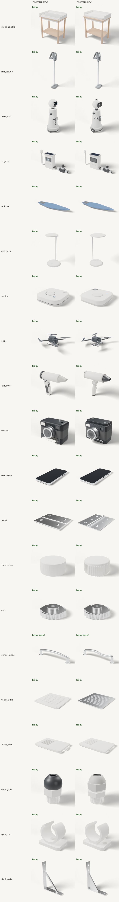

# CAD codegen benchmark: retrieval-augmented prompts (C4)

**Question.** The AI (route `main` = `openai/gpt-6-sol`) writes build123d programs. Does adding retrieved example
programs and a do/don't list to its prompt (`CODEGEN_RAG=1`) make those programs better or more reliable than the
current prompt (`CODEGEN_RAG=0`)?

**Answer (2026-09-28).** Not measurably, on this benchmark. The current prompt already gets every one of the 20
prompts right on the first try, so validity has no room to improve. Across 29 paired runs the quality signals (a vision
judge, and the ±25 % size check) move by amounts that are within run-to-run noise. The cost is about 2.7× more
prompt tokens per call and +0–23 % spend. **Recommendation: keep `CODEGEN_RAG=0` as the default.** The flag stays
available, and the library is useful on its own (see the end of this page).

## What `CODEGEN_RAG=1` changes

Everything is in `api/cad/codegen/`. With the flag off, prompts are byte-identical to before; a test checks this.

- **Library** (`examples/`, 84 programs; details in `examples/README.md`):
  - 17 seed programs from our product families and 1 generic example.
  - 66 hand-written idioms: 22 enclosures (`encl_`), 22 revolves, lofts, sweeps and threads (`form_`), 22 patterns,
    mirrors and joints (`mech_`).
  - Every program runs in the real sandbox. Its bounding box is measured and stored in `examples/index.json`.
- **Retrieval** (`retrieval.py`): BM25 in pure Python over each example's tags, title, description and the
  build123d calls in its code, plus a small synonym table.
  - Picks up to 4 examples (2 when editing) within a 9,000-character budget (5,000 when editing).
  - Excludes the seed program that is already in the prompt, and returns at most one variant per product family.
  - Drops weak matches: below a score of 3, or below 35 % of the best match.
- **System prompt**: a build123d 0.13 do/don't list is appended (`engine.RAG_RULES`). It was compiled from gotchas
  verified while writing the library: shell before fillet; `Locations * shape` returns a list; `mirror` returns only
  the copy; `Locations * Pos` is a TypeError; twisted Ellipse lofts silently produce broken solids; `split` defaults
  to cutting on Plane.XZ; and others.
- **Repair prompt**: the sandbox error is matched against a table of known errors to add a "Likely fix" hint
  (`engine.repair_hints`).

## Method

- **Prompts**: 20 fixed prompts in `tests/cad_bench.py`. 11 are product categories (changing table, stick vacuum,
  home robot, irrigation, surfboard, desk lamp, BLE tag, drone, hair dryer, camera, smartphone). 9 are harder parts:
  hinge, threaded cap, gear, curved handle, vented grille, battery door, cable gland, clip, bracket. Each prompt
  comes with a target size.
- **Engine**: the real `generate_cad`, with the sandbox, size validation, up to 2 repairs and the fallback. Same
  model and settings as production: `max_tokens` 7000, reasoning effort `low`.
- **Metrics**:
  - valid first try: status `ok`
  - valid after repair: status `ok` or `repaired`
  - mean repairs
  - bbox within ±25 % of the target on each of the three dimensions (sorted), which is stricter than the engine's
    own 0.5×–2× check
  - every part passes OCCT `is_valid`
  - seconds and dollars, from OpenRouter's per-call usage
- **Vision judge**: `google/gemini-3.8-flash`, a different model family from the generator. It sees one 480 px
  Blender render per result, without knowing which mode produced it. For each result it checks 2–4 must-have visible
  features per prompt (`FEATURES` in the harness) and scores "recognisable" from 1 to 5.
- **Runs**: run 1 covers all 20 prompts in both modes. Run 2 (`CAD_BENCH_RUN=_r2`) repeats the 9 hard prompts in both
  modes, to see how much results vary between runs.
- **Renders**: `docs/screens/cad_bench/<id>_rag{0,1}[_r2].png`, with contact sheets `sheet.png` and
  `sheet_r2.png`. Raw rows and the generated programs are in `tests/results/cad_bench/`.

```bash
uv run python tests/cad_bench.py run --rag 0 && uv run python tests/cad_bench.py run --rag 1
uv run python tests/cad_bench.py render && uv run python tests/cad_bench.py judge && uv run python tests/cad_bench.py report
```

## Results: run 1 (20 prompts)

<!-- BENCH:START -->
| metric | CODEGEN_RAG=0 | CODEGEN_RAG=1 |
|---|---|---|
| prompts | 20 | 20 |
| valid first try | 100 % | 100 % |
| valid after repair | 100 % | 100 % |
| mean repairs | 0.00 | 0.00 |
| bbox within ±25 % of target | 95 % | 95 % |
| all parts pass OCCT is_valid | 100 % | 100 % |
| must-have features visible (vision judge) | 89 % | 92 % |
| recognisable, 1–5 (vision judge) | 4.30 | 4.65 |
| mean seconds / prompt | 27 | 28 |
| mean prompt tokens / call | 1,830 | 4,914 |
| total cost (USD) | $0.392 | $0.483 |

| prompt | target mm | RAG=0 | RAG=1 | examples retrieved (RAG=1) |
|---|---|---|---|---|
| changing_table | 800/520/950 | ✅ first try · 800/520/950 · feat 4/4 · 24s | ✅ first try · 800/520/950 · feat 4/4 · 26s | `mech_drawer_cabinet`, `mech_shelf_bracket`, `form_lamp_shade_loft`, `encl_drafted_shell` |
| stick_vacuum | 250/240/1150 | ✅ first try · 245/240/1128 · feat 4/4 · 38s | ✅ first try · 242/230/1152 · feat 4/4 · 47s | `seed_hair_dryer_pistol`, `mech_honeycomb_panel`, `form_dome_sphere_split`, `encl_remote_buttons` |
| home_robot | 450/420/950 | ✅ first try · 386/376/935 · feat 4/4 · 36s | ✅ first try · 412/393/950 · feat 4/4 · 36s | `encl_thermostat_round`, `encl_display_bezel`, `form_duct_rect_to_round`, `encl_hex_speaker_grille` |
| irrigation | 420/90/220 | ✅ first try · 412/78/216 · feat 3/3 · 36s | ✅ first try · 418/78/212 · feat 3/3 · 36s | `seed_solar_array_roof`, `form_tapered_nozzle`, `form_ergonomic_grip`, `encl_display_bezel` |
| surfboard | 1830/510/150 | ✅ first try · 1830/510/147 · feat 2/3 · 32s | ✅ first try · 1830/511/134 · feat 2/3 · 38s | `mech_heatsink_fins`, `encl_pcb_standoffs`, `mech_shelf_bracket` |
| desk_lamp | 220/180/420 | ✅ first try · 180/202/420 · feat 3/3 · 21s | ✅ first try · 220/190/420 · feat 3/3 · 24s | `mech_desk_lamp`, `form_lamp_shade_loft`, `mech_spoked_wheel`, `encl_desk_hub` |
| ble_tag | 42/42/9 | ✅ first try · 42/42/9 · feat 4/4 · 20s | ✅ first try · 42/42/9 · feat 4/4 · 20s | `form_pebble_speaker`, `mech_keyboard_keys`, `encl_desk_hub`, `encl_remote_buttons` |
| drone | 330/360/110 | ✅ first try · 319/293/104 · feat 2/4 · 37s | ✅ first try · 275/347/86 · feat 3/4 · 32s | `form_propeller`, `form_dome_sphere_split`, `seed_camera_compact`, `mech_ball_joint` |
| hair_dryer | 220/75/200 | ✅ first try · 220/66/191 · feat 4/4 · 33s | ✅ first try · 218/65/201 · feat 3/4 · 37s | `form_tapered_nozzle`, `form_mug_swept_handle`, `form_ergonomic_grip`, `form_handle_spline_sweep` |
| camera | 150/115/120 | ✅ first try · 151/110/117 · feat 4/4 · 26s | ✅ first try · 151/119/122 · feat 4/4 · 34s | `form_dome_sphere_split`, `seed_smartphone_mini`, `encl_remote_buttons`, `encl_snap_fit_clip` |
| smartphone | 70/145/9 | ✅ first try · 71/145/9 · feat 3/4 · 31s | ✅ first try · 71/145/9 · feat 3/4 · 28s | `encl_usbc_cutout`, `encl_wall_adapter`, `encl_desk_hub`, `seed_hair_dryer_compact` |
| hinge | 76/64/6 | ✅ first try · 76/64/6 · feat 2/4 · 21s | ✅ first try · 64/77/6 · feat 4/4 · 26s | `mech_butt_hinge` |
| threaded_cap | 44/44/20 | ✅ first try · 44/44/20 · feat 2/3 · 29s | ✅ first try · 44/44/20 · feat 2/3 · 28s | `form_screw_cap_thread`, `form_jar_neck_thread` |
| gear | 52/52/16 | ✅ first try · 52/52/16 · feat 4/4 · 22s | ✅ first try · 52/52/16 · feat 3/4 · 12s | `form_spur_gear` |
| curved_handle | 160/25/35 | ✅ first try · 158/18/35 ⚠ · feat 2/2 · 24s | ✅ first try · 158/16/36 ⚠ · feat 2/2 · 19s | `form_handle_spline_sweep`, `mech_drawer_cabinet` |
| vented_grille | 120/120/4 | ✅ first try · 120/120/4 · feat 3/3 · 20s | ✅ first try · 120/120/4 · feat 3/3 · 18s | `encl_vent_slots`, `mech_perforated_panel`, `mech_heatsink_fins`, `encl_screw_bosses` |
| battery_door | 45/30/4 | ✅ first try · 45/30/4 · feat 3/3 · 23s | ✅ first try · 44/29/4 · feat 3/3 · 29s | `encl_battery_door` |
| cable_gland | 28/28/40 | ✅ first try · 28/26/40 · feat 2/3 · 20s | ✅ first try · 28/24/40 · feat 3/3 · 22s | `encl_cable_gland` |
| spring_clip | 32/24/30 | ✅ first try · 32/24/29 · feat 3/3 · 29s | ✅ first try · 32/24/28 · feat 3/3 · 31s | `encl_din_rail_clip`, `encl_snap_fit_clip`, `mech_bike_handlebar`, `encl_wall_bracket` |
| shelf_bracket | 150/30/200 | ✅ first try · 150/30/200 · feat 3/3 · 26s | ✅ first try · 150/30/200 · feat 3/3 · 23s | `mech_shelf_bracket`, `encl_wall_bracket`, `mech_gusset_l_bracket`, `encl_screw_bosses` |
<!-- BENCH:END -->



## Results: run 2 (repeat of the 9 hard prompts)

The 11 product prompts were not repeated; their rows show "—".

<!-- BENCH_r2:START -->
| metric | CODEGEN_RAG=0 | CODEGEN_RAG=1 |
|---|---|---|
| prompts | 9 | 9 |
| valid first try | 100 % | 100 % |
| valid after repair | 100 % | 100 % |
| mean repairs | 0.00 | 0.00 |
| bbox within ±25 % of target | 100 % | 100 % |
| all parts pass OCCT is_valid | 100 % | 100 % |
| must-have features visible (vision judge) | 94 % | 91 % |
| recognisable, 1–5 (vision judge) | 4.89 | 4.78 |
| mean seconds / prompt | 28 | 24 |
| mean prompt tokens / call | 1,414 | 3,819 |
| total cost (USD) | $0.106 | $0.104 |

| prompt | target mm | RAG=0 | RAG=1 | examples retrieved (RAG=1) |
|---|---|---|---|---|
| changing_table | 800/520/950 | — | — | — |
| stick_vacuum | 250/240/1150 | — | — | — |
| home_robot | 450/420/950 | — | — | — |
| irrigation | 420/90/220 | — | — | — |
| surfboard | 1830/510/150 | — | — | — |
| desk_lamp | 220/180/420 | — | — | — |
| ble_tag | 42/42/9 | — | — | — |
| drone | 330/360/110 | — | — | — |
| hair_dryer | 220/75/200 | — | — | — |
| camera | 150/115/120 | — | — | — |
| smartphone | 70/145/9 | — | — | — |
| hinge | 76/64/6 | ✅ first try · 76/64/6 · feat 3/4 · 30s | ✅ first try · 64/76/6 · feat 3/4 · 26s | `mech_butt_hinge` |
| threaded_cap | 44/44/20 | ✅ first try · 44/44/20 · feat 2/3 · 47s | ✅ first try · 44/44/20 · feat 2/3 · 21s | `form_screw_cap_thread`, `form_jar_neck_thread` |
| gear | 52/52/16 | ✅ first try · 52/52/16 · feat 4/4 · 26s | ✅ first try · 52/52/16 · feat 3/4 · 18s | `form_spur_gear` |
| curved_handle | 160/25/35 | ✅ first try · 169/25/41 · feat 2/2 · 24s | ✅ first try · 159/23/36 · feat 2/2 · 22s | `form_handle_spline_sweep`, `mech_drawer_cabinet` |
| vented_grille | 120/120/4 | ✅ first try · 120/120/4 · feat 3/3 · 22s | ✅ first try · 120/120/4 · feat 3/3 · 19s | `encl_vent_slots`, `mech_perforated_panel`, `mech_heatsink_fins`, `encl_screw_bosses` |
| battery_door | 45/30/4 | ✅ first try · 46/30/4 · feat 3/3 · 24s | ✅ first try · 45/29/4 · feat 3/3 · 27s | `encl_battery_door` |
| cable_gland | 28/28/40 | ✅ first try · 28/24/40 · feat 3/3 · 27s | ✅ first try · 28/24/40 · feat 3/3 · 27s | `encl_cable_gland` |
| spring_clip | 32/24/30 | ✅ first try · 32/24/29 · feat 3/3 · 27s | ✅ first try · 38/24/27 · feat 3/3 · 28s | `encl_din_rail_clip`, `encl_snap_fit_clip`, `mech_bike_handlebar`, `encl_wall_bracket` |
| shelf_bracket | 150/30/200 | ✅ first try · 150/30/200 · feat 3/3 · 23s | ✅ first try · 30/150/200 · feat 3/3 · 29s | `mech_shelf_bracket`, `encl_wall_bracket`, `mech_gusset_l_bracket`, `encl_screw_bosses` |
<!-- BENCH_r2:END -->

## Reading the numbers

- **Validity is at the ceiling.** 58 of 58 generations were valid on the first try: 29 per mode, no repairs, every
  part `is_valid`. The seed program in the prompt, together with `gpt-6-sol`, already covers this benchmark. So the
  do/don't list and the repair hints could not be measured here, because nothing failed.
- **The vision-judge results are mixed, and the gaps are within noise.**
  - Run 1 favours RAG=1: 92 % vs 89 % of features visible, recognisability 4.65 vs 4.30. Most of that comes from the
    hinge (2/4 → 4/4 features), the cable gland and the drone.
  - Run 2 of the hard prompts favours RAG=0: 94 % vs 91 %, and 4.89 vs 4.78.
  - The same prompt in the same mode moves by up to 2 features between runs (hinge RAG=0: 2/4, then 3/4).
  - The judge sees one small view. It misses internal threads in both modes, and it missed a 1.5 mm keyway in both
    RAG=1 gears even though the keyway is in the code. The judge cost about $0.13 in total.
- **Programs change style with RAG=1.** They use more of the library's idioms. Across the 20 run-1 programs,
  `PolarLocations`, `GridLocations`, `revolve` and `offset` appear 6 times with RAG=1 and never with RAG=0.
  RAG=1 programs also fuse more: 1.7 vs 7.6 labelled parts per hard part in run 2. Fewer labelled parts means less
  colour and material separation in the viewer.
- **Cost.** Mean prompt tokens per call are about 2.7× higher (4,914 vs 1,830 in run 1). Spend was +23 % in run 1
  ($0.483 vs $0.392) and about equal in run 2 ($0.104 vs $0.106), because output and reasoning tokens dominate the
  cost and vary between runs. Latency is about the same.
- **Bias warning.** The idioms were written for this task, after the benchmark topics were set. Several hard prompts
  have a closely matching example: `mech_butt_hinge`, `form_spur_gear`, `encl_cable_gland`, `encl_battery_door`,
  `encl_vent_slots`, `mech_shelf_bracket`. That favours RAG=1, and it still did not show a clear gain.
- **Not run.** RealCADBench and CADBench were not trivially loadable (no ready build123d prompt and target files), so
  they are not included.

## Recommendation

1. **Keep `CODEGEN_RAG=0` as the default.** There is no measured gain, prompts are 2.7× longer, and parts get
   fused into fewer labelled parts.
2. **Re-test once there are failures to fix.** The benchmark should be rerun (about $0.9 for both modes) when:
   - production prompts start needing repairs (watch `attempts` in `model_vN.json`),
   - the `main` model changes to a cheaper or weaker one, or
   - editing gets its own benchmark. The retrieval block only helps when the model does not already know the API,
     and `gpt-6-sol` does.
3. **Harden the benchmark before that.** The next version needs prompts that make the current model fail:
   - multi-feature parts (a threaded cap with a tamper ring, a gear pair in mesh),
   - edit instructions,
   - three views per result for the judge, and
   - at least 3 repetitions per prompt.

Spend for this study: about $1.20 on OpenRouter (key usage $15.488 → $16.689), within the $1.50 budget.
